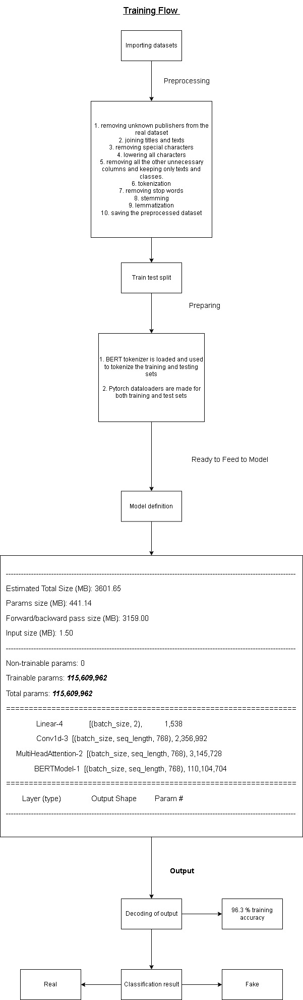

# Fake News Classifier using BERT + CNN

This repository contains a Fake News Classifier model implemented using the BERT (Bidirectional Encoder Representations from Transformers) model along with a CNN (Convolutional Neural Network). The model is developed using PyTorch framework and trained on the LIAR and Kaggle dataset.

## Dataset
The dataset used for this project is a combination of the LIAR dataset and the Kaggle dataset. The LIAR dataset consists of labeled statements from PolitiFact, while the Kaggle dataset contains news articles labeled as "fake" or "real". The combination of these datasets provides a diverse range of fake and real news examples for training and evaluation purposes.

## Workflow
The project workflow can be summarized as follows:

1. Preprocessing: The raw text data from the datasets is preprocessed, which includes steps like lowercasing, tokenization, removing stop words, and stemming or lemmatization. This prepares the text data for further processing.

2. Splitting the Dataset: The preprocessed dataset is split into training, validation, and testing sets. The training set is used to train the model, the validation set is used to tune hyperparameters and evaluate the model during training, and the testing set is used to evaluate the final model's performance.

3. Model Development: The Fake News Classifier model is developed using a combination of BERT and CNN. BERT is used to capture contextual word representations, while the CNN layers are employed to capture local patterns and extract relevant features from the input text.

4. Training: The model is trained on the training set using a suitable optimization algorithm (e.g., Adam) and a defined loss function (e.g., cross-entropy loss). During training, the model learns to differentiate between fake and real news based on the provided labeled examples.

5. Evaluation: The trained model's performance is evaluated on the validation set to assess its accuracy, precision, recall, and F1 score. These metrics help in understanding how well the model generalizes to unseen data.

6. Testing on Unseen Text: Finally, the trained model is tested on new unseen text examples to classify them as fake or real news. This step helps to evaluate the model's real-world performance and its ability to generalize to new data.

## Usage
To run the Fake News Classifier model, follow these steps:

1. Set up the environment by installing the necessary dependencies listed in the `requirements.txt` file.

2. Download or clone the repository to your local machine.

3. Open the provided Jupyter Notebook file that contains the step-by-step implementation of the Fake News Classifier using BERT + CNN.

4. Follow the instructions in the notebook to preprocess the dataset, split it into training/validation/testing sets, develop the model architecture, train the model, evaluate its performance, and test it on unseen text.

5. The notebook includes code snippets and explanations for each step to facilitate understanding and execution. Make sure to run each cell sequentially to ensure correct execution.

## Results
After training and evaluation, the model achieves a certain level of accuracy, precision, recall, and F1 score on the validation set. These metrics can be found in the Jupyter Notebook alongside the training process.

Additionally, the model's performance on unseen text examples is assessed using the testing set. The results are reported, providing insights into the model's ability to classify fake and real news accurately.

## Workflow Diagram

## Dataset Sources
- LIAR dataset: [PolitiFact](https://www.politifact.com/) dataset
- Kaggle dataset: [Fake and Real News Dataset](https://www.kaggle.com/clmentbisaillon/fake-and-real-news-dataset) by Clément Bisaillon

## License
The

 code in this repository is licensed under the [MIT License](LICENSE).

## Acknowledgments
- The creators of the LIAR and Kaggle datasets for providing the labeled news data.
- The PyTorch community for developing and maintaining the PyTorch framework.
